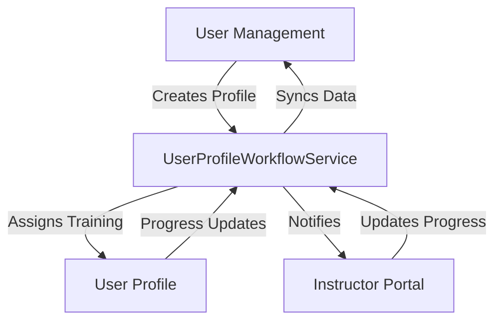

# 🔄 Complete Profile Workflow System

## Overview

FleetFlow now has a comprehensive profile workflow system that seamlessly connects **User
Management**, **User Profile**, and **Instructor Portal** pages for complete training lifecycle
management.

## 🎯 System Architecture

### Core Components

1. **UserProfileWorkflowService.ts** - Central orchestration service
2. **User Management Page** (`/user-management`) - Admin profile creation and training assignment
3. **User Profile Page** (`/user-profile`) - Individual user training progress tracking
4. **Instructor Portal Page** (`/instructor-portal`) - Training monitoring and progress updates

## 🔄 Complete Workflow Process

### Step 1: User Creation (User Management)

```typescript
// Admin creates new user profile
const newUser = userDataService.createUser(userData);

// System automatically:
// 1. Initializes workflow tracking
// 2. Assigns role-based training modules
// 3. Creates instructor notifications
// 4. Sets up progress monitoring
```

### Step 2: Training Assignment (User Management → User Profile)

- **User Management** assigns specific training modules to users
- **Training assignments** are automatically synced to user profiles
- **Progress tracking** is initialized for each assigned module
- **Instructor notifications** are sent for new assignments

### Step 3: Progress Tracking (User Profile)

```typescript
// User profile displays real-time training data:
{
  trainingProgress: [
    {
      moduleId: 'dispatch_fundamentals',
      moduleName: 'Dispatch Fundamentals',
      status: 'in_progress', // not_started | in_progress | completed
      progress: 65, // 0-100%
      instructor: 'Sarah Johnson',
      startedDate: '2024-01-25',
      completedDate: undefined,
      score: undefined,
      timeSpent: 45, // minutes
      attempts: 1
    }
  ]
}
```

### Step 4: Instructor Monitoring (Instructor Portal)

- **Real-time student progress** monitoring
- **Performance metrics** tracking
- **Direct progress updates** capability
- **Student communication** tools

## 📊 Data Flow Architecture



## 🎓 Training Module System

### Available Modules

- **Dispatch Fundamentals** (Sarah Johnson)
- **Load Management** (Mike Chen)
- **Driver Communication** (Lisa Rodriguez)
- **Safety Protocols** (Robert Davis)
- **DOT Compliance** (Jennifer Wilson)
- **Broker Fundamentals** (Mark Thompson)
- **Rate Negotiation** (Amanda Garcia)
- **Customer Relations** (David Martinez)
- **Market Analysis** (Emily Brown)
- **Leadership Skills** (Frank Miller)

### Role-Based Auto-Assignment

```typescript
const roleTrainingMap = {
  'DC': ['dispatch_fundamentals', 'load_management', 'driver_communication', 'safety_protocols'], // Dispatcher
  'BB': ['broker_fundamentals', 'rate_negotiation', 'customer_relations', 'market_analysis'], // Broker
  'DM': ['safety_protocols', 'dot_compliance', 'customer_relations'], // Driver
  'MGR': ['leadership_skills', 'market_analysis', 'safety_protocols', 'customer_relations'] // Manager
};
```

## 🔧 Implementation Features

### 1. User Management Integration

- **Profile Creation** triggers complete workflow initialization
- **Training Assignment** interface for admins
- **Progress Monitoring** dashboard for management oversight
- **Permission Management** connected to training completion

### 2. User Profile Enhancements

- **Real-time Training Progress** display
- **Assignment Tracking** with due dates and priorities
- **Completion Status** with scores and certificates
- **Instructor Contact** information for each module

### 3. Instructor Portal Features

- **Student Dashboard** with progress overview
- **Performance Metrics** tracking
- **Direct Progress Updates** capability
- **Communication Tools** for student interaction

## 📈 Progress Tracking System

### Training Status Types

- `not_started` - Module assigned but not begun
- `in_progress` - Module actively being completed
- `completed` - Module finished with score

### Progress Metrics

- **Individual Module Progress** (0-100%)
- **Overall Training Completion** (average across all modules)
- **Time Spent** tracking
- **Attempt Counting** for retakes
- **Score Recording** for completed modules

## 🔄 Workflow Status Tracking

### User Workflow States

- `onboarding` - Initial profile setup and ICA completion
- `training` - Active training module completion
- `active` - All training completed, full system access
- `suspended` - Temporarily restricted access

## 🎯 Business Benefits

### For Administrators

- **Centralized Training Management** - Assign and track all training from one location
- **Progress Visibility** - Real-time oversight of all user training progress
- **Automated Workflows** - Role-based training assignment and progress tracking
- **Compliance Tracking** - Ensure all users complete required training

### For Users

- **Clear Training Path** - Know exactly what training is required and when
- **Progress Tracking** - See completion status and scores for all modules
- **Instructor Access** - Direct connection to training instructors
- **Achievement Recognition** - Certificates and completion tracking

### For Instructors

- **Student Overview** - Monitor all assigned students from one dashboard
- **Progress Management** - Update student progress and provide feedback
- **Performance Analytics** - Track completion rates and identify struggling students
- **Communication Tools** - Direct student contact and messaging

## 🚀 Technical Implementation

### Service Architecture

```typescript
class UserProfileWorkflowService {
  // Profile creation and workflow initialization
  createUserProfile(userData): UserProfile

  // Training assignment and progress management
  assignTrainingToUser(userId, assignments): void
  updateTrainingProgress(userId, moduleId, progress): void

  // Dashboard data for different user types
  getUserProfileWorkflow(userId): UserProfileWorkflowData
  getInstructorDashboard(instructorId): InstructorDashboardData
}
```

### Data Storage

- **LocalStorage** for demo (production would use database)
- **Real-time Synchronization** between all components
- **Workflow State Persistence** across user sessions

## 🔗 System Integration

### Connected Systems

- **User Management** - Profile creation and permission granting
- **User Profile** - Individual training progress and completion
- **Instructor Portal** - Training monitoring and progress updates
- **FleetFlow University℠** - Course content and certification system
- **ICA Onboarding** - Internal staff onboarding workflow
- **Carrier Onboarding** - Driver/carrier onboarding workflow

### API Endpoints (Future Implementation)

```typescript
// Profile workflow endpoints
POST /api/workflow/create-profile
GET /api/workflow/user/{userId}
PUT /api/workflow/training-progress
GET /api/workflow/instructor/{instructorId}

// Training management endpoints
POST /api/training/assign
PUT /api/training/progress
GET /api/training/modules
GET /api/training/student/{userId}
```

## 📋 Usage Examples

### Creating a New User (Admin)

1. Navigate to **User Management**
2. Click **"+ Add New User"**
3. Fill in user details and department
4. System automatically assigns role-based training
5. User profile is created with training assignments
6. Instructors are notified of new student

### Tracking Training Progress (User)

1. Navigate to **User Profile**
2. View **"FleetFlow University℠ Training Progress"** section
3. See assigned modules, completion status, and scores
4. Track overall progress percentage
5. Contact instructors for assistance

### Monitoring Students (Instructor)

1. Navigate to **Instructor Portal**
2. View assigned students and their progress
3. Update student progress as they complete modules
4. Send messages and provide feedback
5. Track performance metrics and completion rates

## 🎯 Success Metrics

### Training Effectiveness

- **Completion Rates** - Percentage of users completing assigned training
- **Time to Completion** - Average time for users to complete training paths
- **Score Averages** - Average scores across all training modules
- **Retry Rates** - Percentage of users requiring module retakes

### System Usage

- **User Engagement** - Frequency of user profile visits and training access
- **Instructor Activity** - Frequency of progress updates and student interactions
- **Admin Efficiency** - Time saved on training management and progress tracking

This complete profile workflow system ensures that all training activities are connected, tracked,
and managed efficiently across the entire FleetFlow platform.
