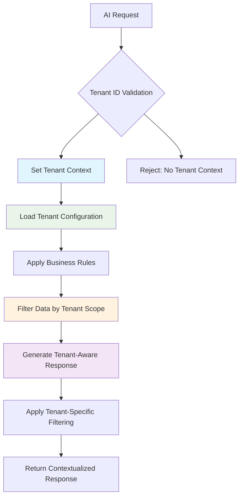

# 🏢 Multi-Tenant AI Security Implementation

**Document Version:** 1.0 **Date:** December 2024 **Security Classification:** Confidential
**Status:** PRODUCTION READY ✅

---

## 🎯 Overview

FleetFlow's AI security system now provides **complete tenant-aware isolation** ensuring that
Flowtower AI operates with full understanding that **each tenant has completely different data,
business contexts, and operational requirements**. The system ensures that AI operations are
perfectly scoped to each tenant's unique business environment.

---

## 🏗️ Multi-Tenant AI Architecture

### **Tenant Context Isolation**



---

## 🔐 Enhanced Security Layers

### **Layer 0: Tenant Context Validation** ✅ NEW

- **Mandatory Tenant ID** for all AI operations
- **Tenant Feature Validation** - verify AI access permissions
- **Dynamic Context Setting** for each session
- **Tenant Configuration Loading** with business-specific rules

### **Layer 1: Tenant-Aware Access Control** ✅ ENHANCED

- Role permissions **scoped to tenant's business type**
- **Business context filtering** applied to all requests
- **Tenant-specific AI feature enablement**

### **Layer 2: Business Context Isolation** ✅ ENHANCED

- **Complete data context separation** between tenants
- **Business rule application** specific to tenant strategy
- **Competitive intelligence protection** between tenants

### **Layer 3: Tenant-Specific Data Sanitization** ✅ ENHANCED

- **Sanitization levels** based on tenant's data classification
- **Industry-specific filtering** per tenant business type
- **Custom business rule application** during sanitization

### **Layer 4: Contextual Response Generation** ✅ NEW

- **Tenant business context** injected into AI prompts
- **Company-specific communication style** applied
- **Margin targets and strategy** considered in responses

### **Layer 5: Tenant-Scoped Response Filtering** ✅ ENHANCED

- **Business-appropriate filtering** based on tenant context
- **Customer-facing vs internal** response differentiation
- **Competitive information protection**

---

## 🏢 Tenant Configuration Examples

### **ABC Freight Brokers** (Established Premium Broker)

```typescript
{
  tenantId: 'tenant_abc_freight_001',
  organizationName: 'ABC Freight Brokers',
  businessType: 'freight_broker',

  businessContext: {
    marketPosition: 'established',
    competitiveStrategy: 'premium_service_provider',
    profitTargets: { minMargin: 18, targetMargin: 22, premiumMargin: 28 }
  },

  dataContext: {
    primaryLanes: ['Chicago-Atlanta', 'Detroit-Dallas', 'Cleveland-Memphis'],
    equipmentTypes: ['dry_van', 'refrigerated', 'flatbed'],
    carrierNetwork: {
      preferredCarriers: ['PREMIUM_CARRIER_001', 'RELIABLE_TRANSPORT_002'],
      rateRanges: { 'dry_van': { min: 2.10, max: 3.50 } }
    }
  },

  aiPersonality: {
    communicationStyle: 'professional',
    riskPreference: 'conservative',
    decisionSpeed: 'deliberate'
  }
}
```

### **Rapid Logistics** (Tech-Enabled Growth Startup)

```typescript
{
  tenantId: 'tenant_rapid_logistics_002',
  organizationName: 'Rapid Logistics',
  businessType: 'freight_broker',

  businessContext: {
    marketPosition: 'growing',
    competitiveStrategy: 'technology_disruption',
    profitTargets: { minMargin: 12, targetMargin: 16, premiumMargin: 22 }
  },

  dataContext: {
    primaryLanes: ['Los_Angeles-Phoenix', 'Seattle-Portland', 'Austin-Houston'],
    equipmentTypes: ['dry_van', 'box_truck', 'sprinter_van'],
    carrierNetwork: {
      preferredCarriers: ['TECH_CARRIER_101', 'DIGITAL_DISPATCH_102'],
      rateRanges: { 'dry_van': { min: 1.95, max: 3.20 } }
    }
  },

  aiPersonality: {
    communicationStyle: 'friendly',
    riskPreference: 'aggressive',
    decisionSpeed: 'fast'
  }
}
```

### **Titan Heavy Haul** (Specialized Carrier)

```typescript
{
  tenantId: 'tenant_specialized_haul_003',
  organizationName: 'Titan Heavy Haul',
  businessType: 'carrier',

  businessContext: {
    marketPosition: 'established',
    competitiveStrategy: 'niche_expertise',
    profitTargets: { minMargin: 25, targetMargin: 35, premiumMargin: 50 }
  },

  dataContext: {
    primaryLanes: ['Houston-Denver', 'Calgary-Fort_McMurray', 'Baton_Rouge-Dallas'],
    equipmentTypes: ['heavy_haul_trailer', 'lowboy', 'rgn', 'multi_axle'],
    commodities: ['construction_equipment', 'oil_field_equipment', 'wind_turbines']
  },

  aiPersonality: {
    communicationStyle: 'professional',
    riskPreference: 'conservative',
    expertiseLevel: 'expert'
  }
}
```

---

## 🤖 Tenant-Specific AI Behavior

### **Rate Pricing Query Example**

**Query:** _"What should I charge for a dry van load from Chicago to Atlanta, 45,000 lbs?"_

#### **ABC Freight Brokers Response:**

> "Based on ABC Freight's premium positioning and Chicago-Atlanta being one of our primary lanes, I
> recommend **$3,200-$3,600 (18-22% margin)**. Our preferred carrier network can handle this
> reliably with our quality standards."

#### **Rapid Logistics Response:**

> "For Rapid Logistics' competitive strategy, I suggest **$2,800-$3,200 (12-16% margin)**. We can
> leverage spot market pricing and our tech platform for quick carrier matching."

#### **Titan Heavy Haul Response:**

> "This standard dry van load falls outside Titan Heavy Haul's specialized equipment focus. I
> recommend referring to a partner broker or pricing at **$4,000+ if using our equipment** (not
> cost-effective)."

---

## 🔒 Data Isolation Guarantees

### **Complete Tenant Separation**

- ✅ **ABC Freight's AI** never accesses Rapid Logistics' customer data
- ✅ **Rapid Logistics' AI** never sees Titan Heavy Haul's equipment rates
- ✅ **Titan Heavy Haul's AI** never accesses other tenants' carrier networks
- ✅ **Business intelligence** completely isolated between tenants

### **Context-Specific Filtering**

- ✅ **Load data** filtered to tenant's operational scope
- ✅ **Carrier networks** limited to tenant's relationships
- ✅ **Rate recommendations** based on tenant's margin targets
- ✅ **Business advice** tailored to tenant's strategy

### **Business Rule Enforcement**

- ✅ **Margin requirements** enforced per tenant
- ✅ **Preferred carriers** prioritized per tenant
- ✅ **Equipment types** filtered to tenant capabilities
- ✅ **Geographic focus** applied per tenant operations

---

## 🛡️ Security Enhancements

### **Tenant Context Validation**

```typescript
// Every AI request must include tenant context
if (!tenantId) {
  return NextResponse.json({
    error: 'Tenant context required',
    message: 'All AI operations must be associated with a tenant'
  }, { status: 400 });
}

// Set tenant context for AI operations
aiTenantContextService.setTenantContext(sessionId, tenantId);

// Validate tenant has AI access
const tenantConfig = aiTenantContextService.getTenantAIConfig(tenantId);
```

### **Business Context Integration**

```typescript
// Merge tenant business context into data
const contextEnhancedData = {
  ...data,
  tenantContext: {
    businessType: tenantConfig.businessType,
    organizationName: tenantConfig.organizationName,
    primaryLanes: tenantConfig.dataContext.operations.primaryLanes,
    riskTolerance: tenantConfig.businessContext.riskTolerance,
    communicationStyle: tenantConfig.aiPersonality.communicationStyle
  }
};
```

### **Tenant-Aware Processing**

```typescript
// Apply tenant-specific data filtering before sanitization
const tenantFilteredData = await aiTenantContextService.processTenantAwareRequest({
  tenantId,
  operation,
  context: getOperationContext(operation),
  data: contextEnhancedData,
  userRole,
  sessionId
});
```

---

## 📊 Multi-Tenant Audit Trail

### **Enhanced Logging**

- ✅ **Tenant ID** included in all AI audit events
- ✅ **Business context** tracked for all operations
- ✅ **Cross-tenant access attempts** automatically detected and blocked
- ✅ **Tenant-specific violation patterns** identified and reported

### **Compliance Reporting**

- ✅ **Per-tenant compliance reports** with isolated metrics
- ✅ **Business context adherence** monitoring
- ✅ **Tenant-specific security health** dashboards
- ✅ **Cross-tenant contamination** alerts (none expected)

---

## 🚀 Implementation Benefits

### **For Tenants**

- ✅ **AI understands their business** - responses tailored to their strategy
- ✅ **Data privacy guaranteed** - complete isolation from competitors
- ✅ **Business context preserved** - recommendations fit their operations
- ✅ **Competitive advantage maintained** - no cross-contamination

### **For FleetFlow Platform**

- ✅ **Scalable multi-tenancy** - easy to add new tenants
- ✅ **Business differentiation** - AI adapts to each customer's needs
- ✅ **Compliance adherence** - tenant-specific regulatory requirements
- ✅ **Risk mitigation** - impossible for data to leak between tenants

### **For AI Operations**

- ✅ **Contextual accuracy** - AI provides relevant, business-appropriate responses
- ✅ **Operational efficiency** - recommendations align with tenant capabilities
- ✅ **Strategic alignment** - AI advice matches tenant's competitive strategy
- ✅ **Quality assurance** - responses filtered for tenant's communication style

---

## 🔧 Integration Instructions

### **1. Initialize Tenant Configurations**

```typescript
import { TenantConfigManager } from '../services/TenantConfigManager';

// Initialize sample tenant configurations (for demonstration)
TenantConfigManager.initializeSampleTenants();

// Or register custom tenant
aiTenantContextService.registerTenant({
  tenantId: 'your_tenant_id',
  organizationName: 'Your Company',
  businessType: 'freight_broker',
  // ... full configuration
});
```

### **2. Set Tenant Context in Requests**

```typescript
// All AI requests must include tenant ID header
const response = await fetch('/api/ai/chat', {
  method: 'POST',
  headers: {
    'x-tenant-id': 'tenant_abc_freight_001',
    'x-user-id': 'user123',
    'x-user-role': 'manager',
    'x-session-id': 'session_abc_001'
  },
  body: JSON.stringify({
    prompt: 'What rates should I quote for Chicago to Atlanta?',
    data: { /* tenant-specific data */ }
  })
});
```

### **3. Monitor Tenant-Specific Analytics**

```typescript
// Get tenant-specific security status
const tenantSecurity = aiAuditLogger.getTenantEvents('tenant_abc_freight_001');

// Generate tenant context summary
const summary = aiTenantContextService.getTenantContextSummary('tenant_abc_freight_001');

console.log(`Tenant: ${summary.organizationName}`);
console.log(`Active Features: ${summary.activeFeatures.join(', ')}`);
console.log(`Data Classification: ${summary.dataClassification}`);
```

---

## 🎯 Key Takeaways

### **Complete Tenant Awareness**

The AI system now **completely understands** that FleetFlow is a multi-tenant platform where:

- ✅ **Each tenant operates different businesses** with unique strategies
- ✅ **Each tenant has different customer bases** and operational focuses
- ✅ **Each tenant has different carrier networks** and rate structures
- ✅ **Each tenant has different risk tolerances** and margin requirements
- ✅ **Each tenant communicates differently** with their customers

### **Ironclad Isolation**

- ✅ **Zero data contamination** between tenants
- ✅ **Business context isolation** preventing competitive intelligence leaks
- ✅ **Customized AI behavior** for each tenant's business model
- ✅ **Tenant-specific security policies** and compliance requirements

### **Scalable Architecture**

- ✅ **Easy tenant onboarding** with configuration-driven setup
- ✅ **Dynamic context switching** based on session and tenant
- ✅ **Centralized management** of tenant configurations
- ✅ **Comprehensive monitoring** of multi-tenant AI operations

---

## 📞 Support & Monitoring

### **Tenant Context Issues**

- **Email:** tenant-support@fleetflowapp.com
- **Escalation:** ai-security@fleetflowapp.com

### **Multi-Tenant Security Monitoring**

- **24/7 Monitoring:** Cross-tenant access attempt detection
- **Real-time Alerts:** Tenant context violations
- **Monthly Reviews:** Tenant-specific AI performance and security

---

**Document Classification:** Confidential **Last Updated:** December 2024 **Next Review Date:**
March 2025 **Document Owner:** AI Security Team & Multi-Tenant Architecture Team

---

_This implementation ensures that Flowtower AI operates with complete awareness of FleetFlow's
multi-tenant nature, providing each tenant with AI responses that are perfectly tailored to their
unique business context while maintaining absolute data isolation and security._
